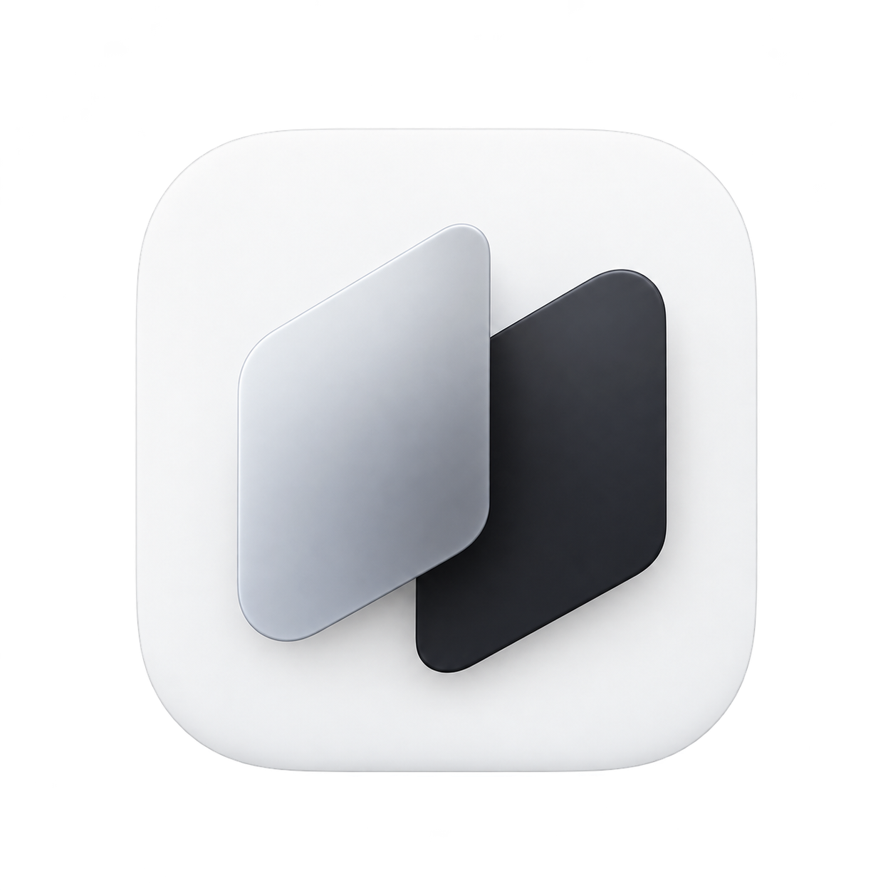

<p align="center">
  
</p>

<h1 align="center">Jerox</h1>

<p align="center">Clipboard history, rewrite, dictation, and screen-text reading for Mac.<br>Each one opens where you are working and pastes back into the app you were using.</p>

<p align="center">
  <a href="LICENSE"></a>
  
  
</p>

---

## What it does

Jerox is a menu-bar app. It has no Dock icon while you work.

| Job | Default shortcut | What happens |
|---|---|---|
| Clipboard history | <kbd>⌃⌥⌘V</kbd> | The list opens at the cursor. Type to filter, press <kbd>↩</kbd> to paste in the original format, <kbd>⇧↩</kbd> for plain text, <kbd>⌘P</kbd> to pin. |
| Rewrite | <kbd>⌘⇧R</kbd> | Select text in any app, pick a tone, and the rewrite replaces it. |
| Dictate | <kbd>⌃⌥⌘D</kbd> | Speak. Text appears at your cursor. Apple Speech shows live text; a downloaded Whisper model runs fully offline. |
| Read the screen | <kbd>⌃⌥⌘T</kbd> | Drag over anything on screen and its text appears on it. Click to copy. |

You can change every shortcut in Settings.

**Privacy.** History stays on your disk. Dictation and screen reading run on your Mac. The network is used only for a rephrase you ask for: either Apple Intelligence on device (macOS 26) or OpenRouter, OpenAI, Anthropic, or Hugging Face with your own key, which is stored in the Keychain.

## Install

Download the latest `.dmg` from [Releases](https://github.com/jxngrx/Jerox/releases), open it, and drag Jerox into Applications. Prefer the macOS Installer? Use the `.pkg` from the same release. On first launch, onboarding walks you through the shortcuts and the three permissions.

Sparkle-enabled builds (after the first tagged release that includes `appcast.xml`) check GitHub for updates from **Check for Updates…**. Installs of **v0.0.1** need that first Sparkle build by hand. See [docs/AUTO_UPDATES.md](docs/AUTO_UPDATES.md).

Builds that are not notarized need one extra step the first time: Control-click Jerox in Applications and choose **Open**.

## Requirements

- macOS 15.1 or later to run.
- Xcode 26 or later to build. The app uses the macOS 26 SDK for Apple Intelligence and falls back on older systems.

## Build and run

```sh
git clone <your-fork-url> jerox
cd jerox
make run      # builds with Xcode and opens the app
```

Or open `Jerox.xcodeproj` in Xcode and press Run.

A fresh clone signs builds ad hoc ("Sign to Run Locally"), so you need no Apple developer account. To sign with your own team, copy `Config/Local.xcconfig.example` to `Config/Local.xcconfig` and set your team ID. That file is git-ignored.

### Permissions

macOS asks for these the first time each feature runs:

| Permission | Needed for |
|---|---|
| Accessibility | Pasting back into the previous app |
| Microphone, Speech Recognition | Dictation |
| Screen Recording | Reading text off the screen |

Ad-hoc builds get a new signature every build, so macOS may ask for Accessibility again after a rebuild. Signing with your team avoids that.

## Tests

```sh
make test
```

This compiles the pure logic (history, paste transforms, classifiers, rephrase prompts, dictation text) on its own and runs its self-checks. No Xcode project or signing is involved. Debug builds of the app also run the same checks at launch.

## Project layout

```
Jerox/                     App sources (Xcode synchronized folder: new files build automatically)
  App/                     Entry point, AppDelegate and its feature extensions, app model
  Clipboard/               Clip model, history, pasteboard read/write, blob store, picker UI
  Rephrase/                Prompts, AI providers, API keys (Keychain), prompt picker UI
  Dictation/               Speech pipeline text helpers, Whisper models, microphones, dictation bar
  ScreenText/              Screen selection, text recognition, caption layout
  Shortcuts/               Default shortcuts, recorder, key caps
  Onboarding/              First-run walkthrough and permissions
  Settings/                Settings window
  DesignSystem/            Colors, logo, shared styles, toast
  Resources/               App icon, menu-bar icon, Info.plist
Config/                    Shared xcconfig, entitlements, your Local.xcconfig for signing
installer/                 DMG background and window layout
scripts/                   release.sh (versioned .dmg and .pkg)
Vendor/                    whisper.cpp prebuilt framework (macOS slice) and its license
site/                      Launch website (static HTML)
assets/brand/              Logo source files
docs/                      Extra documentation
```

Ignored locally: `build/`, `launch/` (launch films), `reference/` (inspiration material).

## Releases

Tag `vX.Y.Z` and push it; CI builds the `.dmg` and `.pkg` and publishes them. Details in [docs/RELEASING.md](docs/RELEASING.md).

## Contributing

Read [CONTRIBUTING.md](CONTRIBUTING.md). Please follow the [Code of Conduct](CODE_OF_CONDUCT.md). Report security issues as described in [SECURITY.md](SECURITY.md).

## License

Jerox is released under the [MIT License](LICENSE). Third-party components and their licenses are listed in [THIRD_PARTY_NOTICES.md](THIRD_PARTY_NOTICES.md).
